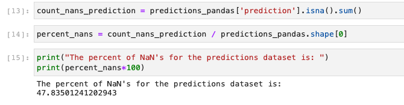
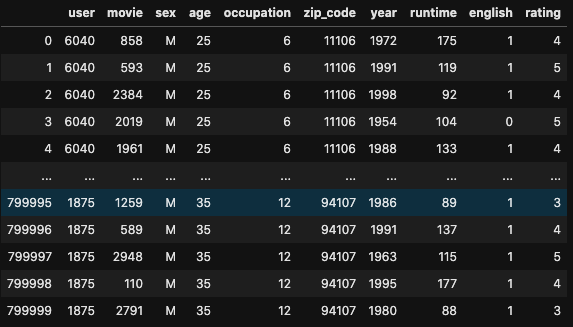

# Movie Predictions with 'Cold Start' User

|Team REC or GET REC'D|
|---|
[Tyler Woods](https://github.com/tylerjwoods)  | 
|[Isaac Campbell-Smith](https://github.com/isaac-campbell-smith) |
|[Feli Gentle](https://github.com/oro13)|

## Table of Contents

- [Basic Overview](#basic-overview)
- [Technologies Used](#technologies)
- [Challenges](#challenges)
- [Exploring Data](#exploring-the-data)
- [ALS in PySpark](#als-in-pyspark)
- [CatBoost](#catboost-regressor)

# Overview

Project: Recommending Movies for Users based on User movie ratings, demographic data on users, and metadata about movies. The goal was to find the top movies the user is most likely to enjoy rather than predicting what they would themselves rate the movies.

# Technologies

- Python Pandas, Numpy, Sklearn, Matplotlib, the usual suspects
- Pyspark, ALS (Alternating Least Squares), a sophisticated algorithm for recommendation that handles NaN values
- CatBoost Regressor Algorithm, gradient boosting random forest specialized for ranking
- Jupyter Lab/Notebook, code writing, testing, and visualization suite
- AWS EC2

# Challenges:

- Massive Datasets (~1 million rows), limited memory for complex calculation
- working between spark and python dataframes
- 'Cold Start' issue of predicting on Users and Movies the trained model had not seen

# Exploring the Data

[MovieLens dataset](http://grouplens.org/datasets/movielens/)

[IMDB Movie Metadata](https://www.kaggle.com/rounakbanik/the-movies-dataset/version/7?select=movies_metadata.csv)

# ALS in Pyspark

Spark ALS model was used first as a baseline prediction. After training the model on the data/training.csv dataset and predicting scores for the data/requests.csv dataset, we found that there were approx. 47% of the ratings with NaN values – meaning a classic ‘cold start’ problem.

For the baseline score, we filled NaN values with the average rating of the training set. Using this model, we obtained a score of 3.54.

# CatBoost Regressor

We wanted to improve our model's NaN values using a more sophisticated approach, so we turned to the CatBoost Gradient Boosted Regresion algorithm and gave it more features to train on. The MovieLens user data would help improve information for users the algorithm has not seen -- sex, age, occupation & zipcode. We also pulled out the year from the movie_title column and added runtime and language metadata from Kaggle's IMDB dataset. Our hope was to go even further and do some text classification on genre, keyword, and cast info but this proved to be way too computationally expensive. The final data we trained on looked like this:

Our expectation was that we could simply use the rating predictions from this model to simply improve our crude estimation of nan values, but the model alone resulted in a score of 4.29. Pretty good! 
