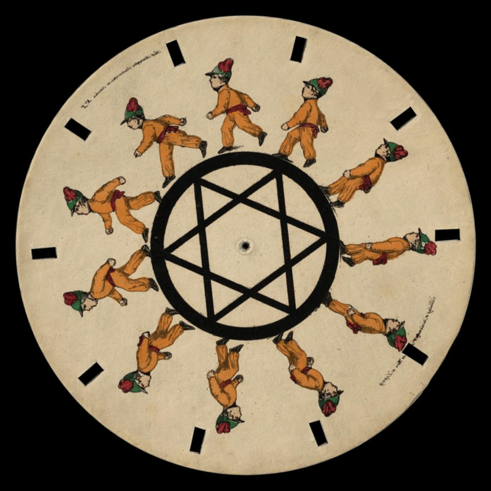
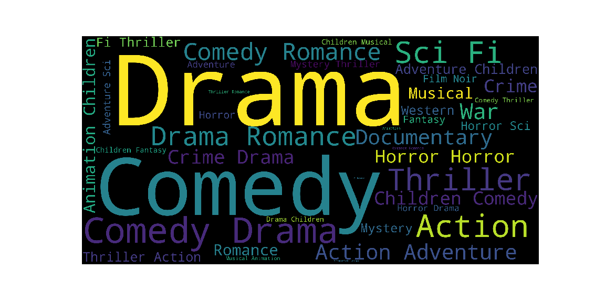
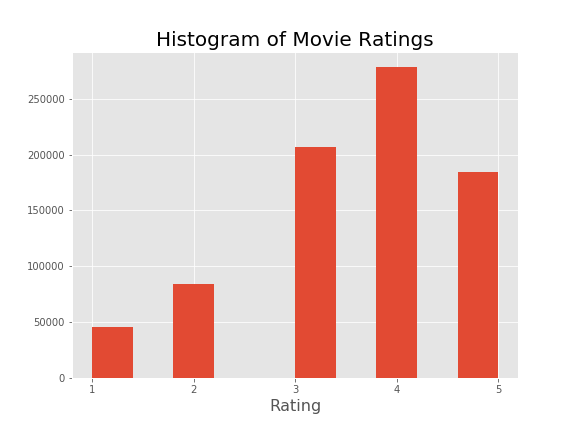

## Team REC or GET REC'D

Movie Predictions with 'Cold Start' Users

[Tyler Woods](https://github.com/tylerjwoods)  | [Isaac Campbell-Smith](https://github.com/isaac-campbell-smith) | [Feli Gentle](https://github.com/oro13)
---|---|---|

## Table of Contents

- [Basic Overview](#basic-overview)
- [Exploring Data](#exploring-data)
- [PySpark](#pyspark)
- []

# Overview

Project: Recommending Movies for Users based on User movie ratings, demographic data on users, and metadata about movies. The goal was to find the top movies the user is most likely to enjoy rather than predicting what they would themselves rate the movies.

# Technologies

- Python Pandas, Numpy, Sklearn, Matplotlib, the usual suspects
- Pyspark, ALS (Alternating Least Squares), a sophisticated algorithm for recommendation that handles NaN values
- CatBoost Regressor Algorithm, gradient boosting random forest specialized for ranking
- Jupyter Lab/Notebook, code writing, testing, and visualization suite
- AWS EC2

# Challenges:

- Massive Datasets (~1 million rows), limited memory for complex calculation
- working between spark and python dataframes
- 'Cold Start' issue of predicting on Users and Movies the trained model had not seen

# The Data

[MovieLens dataset](http://grouplens.org/datasets/movielens/)
[IMDB Movie Metadata](https://www.kaggle.com/rounakbanik/the-movies-dataset/version/7?select=movies_metadata.csv)

IMDB Movie Meta Data Set

# EDA

# Baseline Alternating Least Squares Model with Pyspark

